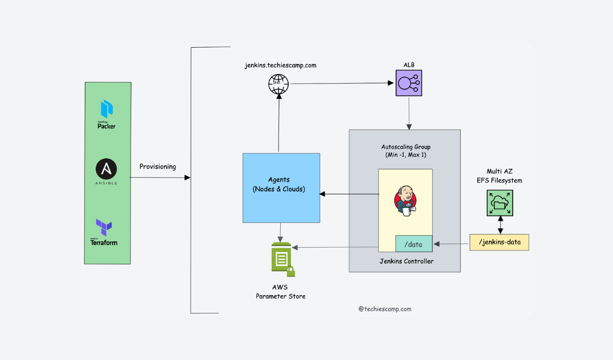

# Jenkins High Availability Deployment on AWS

This project automates the deployment of a scalable and highly available Jenkins infrastructure on AWS using Packer, Terraform, Ansible, AWS Parameter Store, an Application Load Balancer (ALB), and Elastic File System (EFS).

## Table of Contents

- [Overview](#overview)
- [Prerequisites](#prerequisites)
- 
- [Getting Started](#getting-started)
  - [Packer - Build Jenkins AMIs](#packer---build-jenkins-amis)
  - [Terraform - Provision Infrastructure](#terraform---provision-infrastructure)
  - [Ansible - Configure Jenkins](#ansible---configure-jenkins)
- [Usage](#usage)
- [Additional Considerations](#additional-considerations)
- [Contributing](#contributing)


## Overview

This project aims to provide a robust and automated solution for deploying Jenkins with high availability on AWS. It leverages Packer to create custom Amazon Machine Images (AMIs) for the Jenkins controller and agent nodes, Terraform for provisioning the infrastructure, and Ansible for configuring Jenkins instances.

## Prerequisites

Before getting started, ensure you have the following prerequisites:

- AWS account with necessary permissions
- Kashicorp Packer
- Terraform 
- Ansible 
- Valid AWS credentials configured

## Setup Infrastructure


## Getting Started

### Packer - Build Jenkins AMIs

1. Navigate to the `packer` directory:

   ```bash
   cd packer

2. Run Packer to build the custom Jenkins AMIs:

    packer build jenkins-controller.pkr.hcl
    packer build jenkins-agent.pkr.hcl

### Terraform - Provision Infrastructure

1. Navigate to the terraform directory:

    cd terraform

2. Initialize Terraform:

    terraform init

3. Apply the Terraform configuration:

    terraform apply

### Ansible - Configure Jenkins

1. Navigate to the ansible directory:

    cd ansible

2. Run the Ansible playbook to configure Jenkins:

    ansible-playbook -i ../terraform/terraform.py jenkins.yml

## Usage

- Access Jenkins through the ALB DNS name provided in the Terraform output.

- Test Jenkins jobs to ensure high availability and proper load balancing.

- Refer to specific directories for detailed instructions on using Packer, Terraform, and Ansible.

## Additional Considerations

- Security: Review and enhance security settings, including IAM roles and security groups.

- Monitoring: Implement monitoring solutions for infrastructure and Jenkins instances.

- Backup: Set up backup solutions for Jenkins data.

## Contributing

Contributions are welcome! Please fork the repository, create a branch, commit your changes, and open a pull request.


 